# Elsie's Spark - User Guide

Welcome to **Elsie's Spark** — a fun, colourful drawing app made for creating art, doodling, and letting your imagination run wild! No sign-ups, no internet needed, just you and a canvas full of possibilities.

---

## Table of Contents

- [Getting Started](#getting-started)
- [The Room (Home)](#the-room-home)
- [The Canvas](#the-canvas)
- [Toolbar](#toolbar)
- [Brushes](#brushes)
- [Paint Brush](#paint-brush)
- [Colours](#colours)
- [Text](#text)
- [Stickers](#stickers)
- [Shapes](#shapes)
- [Layers](#layers)
- [Selecting & Moving Things](#selecting--moving-things)
- [Eraser](#eraser)
- [Backgrounds & Tracing](#backgrounds--tracing)
- [Undo & Redo](#undo--redo)
- [Zoom & Pan](#zoom--pan)
- [Gallery](#gallery)
- [Daily Sparks (Inspiration)](#daily-sparks-inspiration)
- [Saving & Exporting](#saving--exporting)
- [Keyboard Shortcuts](#keyboard-shortcuts)
- [Touch & Tablet Tips](#touch--tablet-tips)
- [Works Offline!](#works-offline)

---

## Getting Started

Open the app in any modern browser — that's it! No install required. Everything saves automatically to your device, so you can close the tab and come back later without losing a thing.

To run it locally, open a terminal in the project folder and run:

```
python3 -m http.server 8000
```

Then visit `http://localhost:8000` in your browser.

---

## The Room (Home)

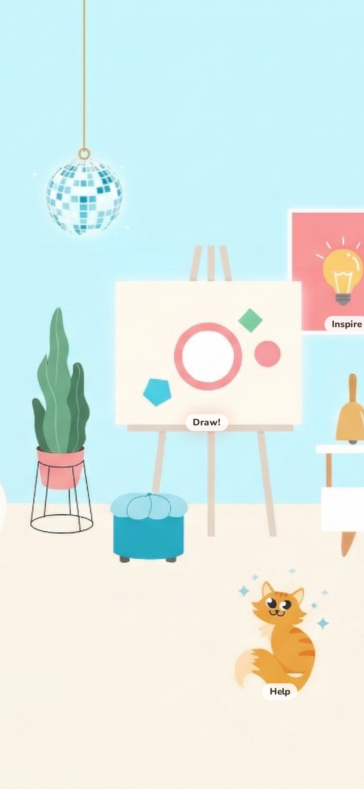

The Room is your home base. From here you can jump to:

- **Draw** — Start a new drawing or continue your current one
- **Gallery** — Browse all your saved artwork
- **Inspire** — Get a daily drawing prompt to spark your creativity
- **Profile** — Your profile and settings

Everything is laid out like a cosy art studio — tap the easel to draw, the picture frames for your gallery, and the lightbulb for inspiration. There's even a helpful cat!

<br clear="both"/>

---

## The Canvas

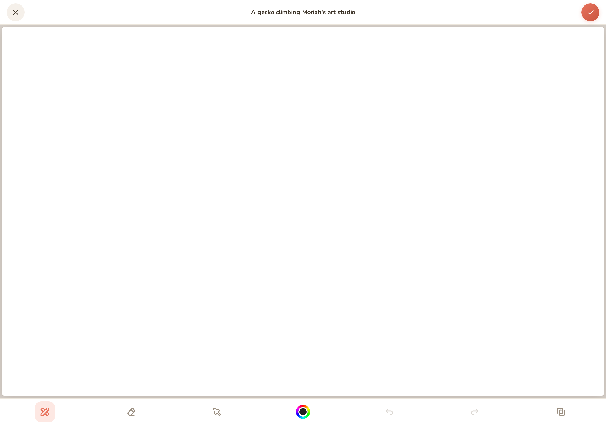

Your canvas starts at a nice big square (sized to fit your screen). This is where all the magic happens — draw, stamp stickers, add text, and layer it all together.

The canvas has three invisible layers stacked on top of each other:
- Your artwork layers (the stuff you draw)
- A live preview layer (shows your brush stroke as you draw it)
- A trace image layer (for tracing over imported photos)

Your daily drawing prompt appears at the top so you always know what to create!

<br clear="both"/>

---

## Toolbar

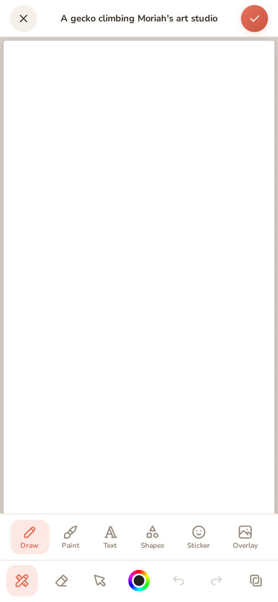

The toolbar sits at the bottom of the screen and gives you quick access to everything:

| Button | What it does |
|--------|-------------|
| **Menu** (three lines) | Opens the tools submenu |
| **Pointer** (arrow) | Select mode — tap things to move, resize, and rotate |
| **Eraser** | Rub out parts of your drawing |
| **Colour** (coloured circle) | Open the colour picker |
| **Undo / Redo** | Take back or bring back actions |
| **Layers** | Manage your layers |

The **tools submenu** expands when you tap the menu button, showing buttons for Brushes, Text, Paint, Stickers, Shapes, and Backgrounds. Tap any of these to open their settings panel (slides up from the bottom).

<br clear="both"/>

---

## Brushes

Elsie's Spark comes packed with **14 different brushes** — from simple pens to magical trees! Tap the **Brushes** button in the submenu to see them all.

### Basic Brushes

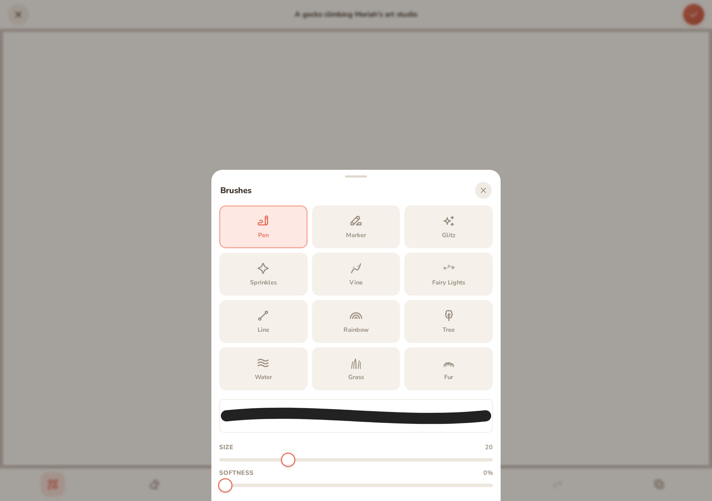

**Pen** — Your trusty default. Smooth, clean lines. Perfect for drawing and writing.

**Marker** — A slightly transparent, flat-edge marker. Great for colouring in and layering up.

**Line** — Click and drag to draw perfectly straight lines between two points. Handy for buildings, borders, and geometric art.

All three basic brushes have these settings:
- **Size** (2–150px) — How thick your stroke is
- **Opacity** (0–100%) — How see-through it is
- **Softness** (0–100%) — Adds a soft, blurry edge

A little **preview** at the top of the brush panel shows you what your stroke will look like before you draw.

<br clear="both"/>

### Decorative Brushes

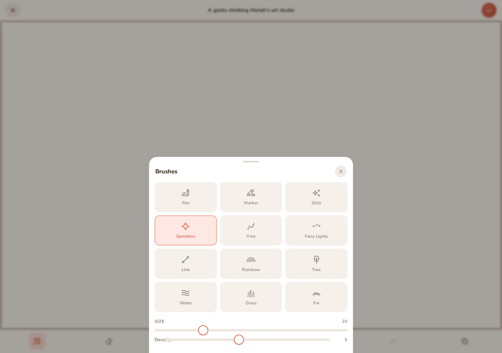

**Sprinkles** — Scatters colourful dots along your stroke like cake sprinkles! Has a **Density** slider (1–10) to control how many sprinkles appear.

**Vine** — Draws organic, curving vine-like strokes. Great for borders and nature scenes.

**Fairy Lights** — Glowing magical orbs trail along your stroke path. You can toggle whether they use your selected colour or their own enchanting glow colours.

**Glitz** — Your stroke gets showered in sparkly particles. Fabulous for adding that extra sparkle to anything.

**Rainbow** — Draws in all the colours of the rainbow at once! Has its own **Opacity** and **Blur** sliders for dreamy rainbow effects.

<br clear="both"/>

### Nature Brushes

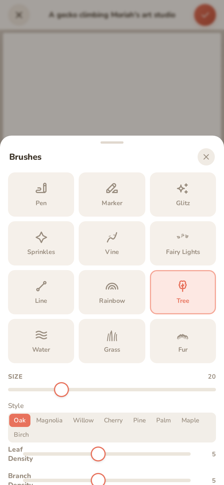

**Tree** — This one is seriously cool. Draw a stroke and a whole tree grows from it! Choose from **8 tree styles**:
- Oak, Magnolia, Willow, Cherry, Pine, Palm, Maple, Birch

Each tree has **Leaf Density** and **Branch Density** sliders so you can make anything from a sparse winter tree to a lush summer one.

<br clear="both"/>

Here's every tree type in action — watch them grow!

| Oak | Magnolia | Willow | Cherry |
|:---:|:---:|:---:|:---:|
|  | 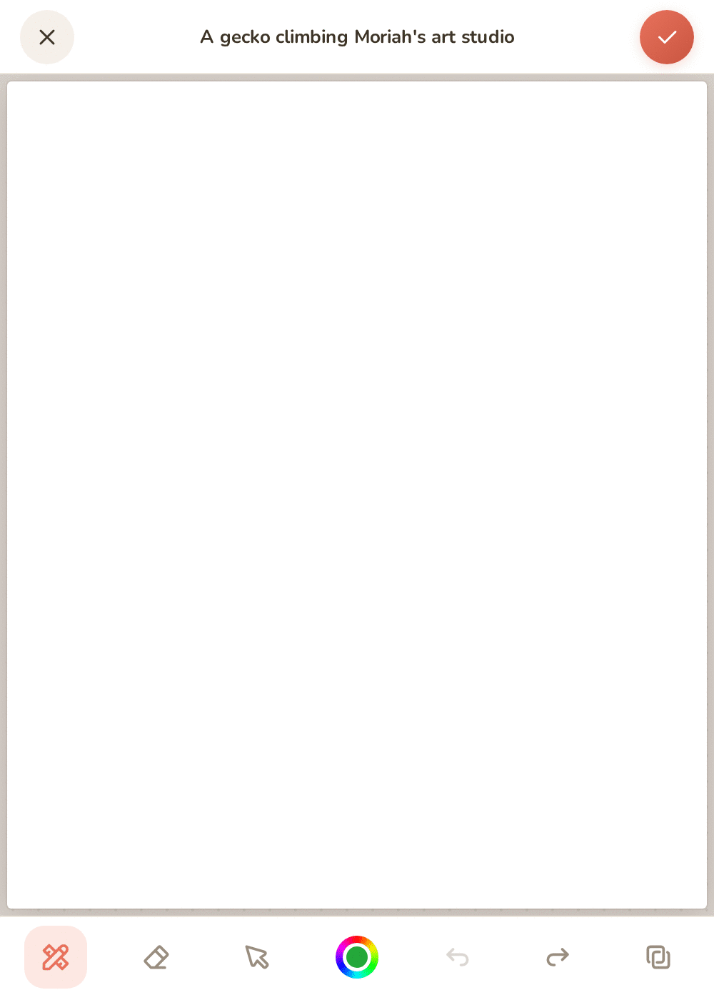 |  |  |

| Pine | Palm | Maple | Birch |
|:---:|:---:|:---:|:---:|
|  |  |  |  |

**Grass** — Blades of grass spring up along your stroke path. Perfect for landscapes.

**Water** — Creates flowing wave and ripple effects. Add a lake or river to your scene!

**Fur** — Draws soft, fuzzy fur texture. Has its own **Blur** slider for extra fluffiness. Great for drawing animals.

---

## Paint Brush

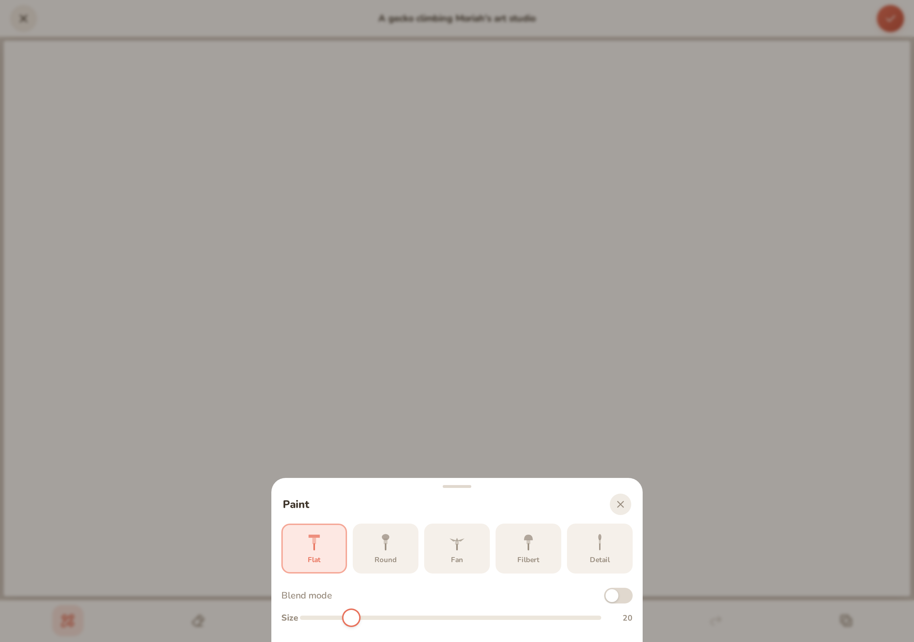

The Paint brush deserves its own section because it's so feature-rich! Open it from the **Paint** button in the submenu.

### Paint Head Styles

Choose from 5 different brush heads:
- **Flat** — Wide, even strokes like a house-painting brush
- **Round** — Tapered tip, great for general painting
- **Fan** — Wide and feathery, lovely for texture and foliage
- **Filbert** — Angled flat top, a classic oil-painting brush shape
- **Detail** — Fine and precise, perfect for small areas

### Paint Settings
- **Size** (2–150px) — Independent from other brush sizes
- **Blend Mode** — When enabled, your brush picks up colours from the canvas as you paint over them and blends them together. It's like real wet paint mixing!

<br clear="both"/>

---

## Colours

Tap the **coloured circle** in the toolbar to open the colour picker. It has three tabs plus some handy extras:

### Grid

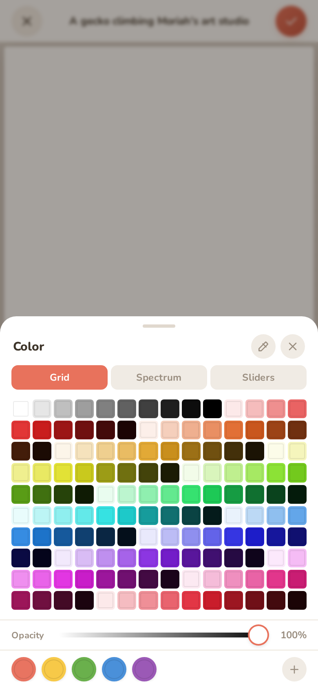

A big grid of **130+ colours** arranged by hue and lightness, plus a grayscale column. Just tap a colour and start drawing — the panel closes automatically.

Your saved swatches appear at the bottom (up to 8). Tap the **+** button to save your current colour for later.

<br clear="both"/>

### Spectrum

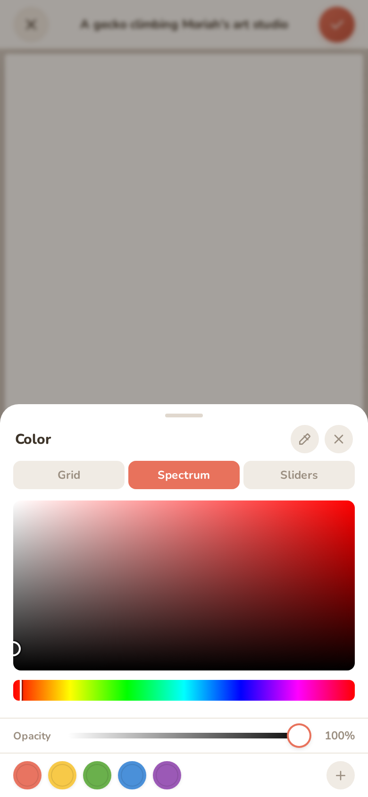

A beautiful 2D colour spectrum you can drag around on, plus a hue bar at the top. Drag anywhere to find exactly the shade you want.

<br clear="both"/>

### Sliders

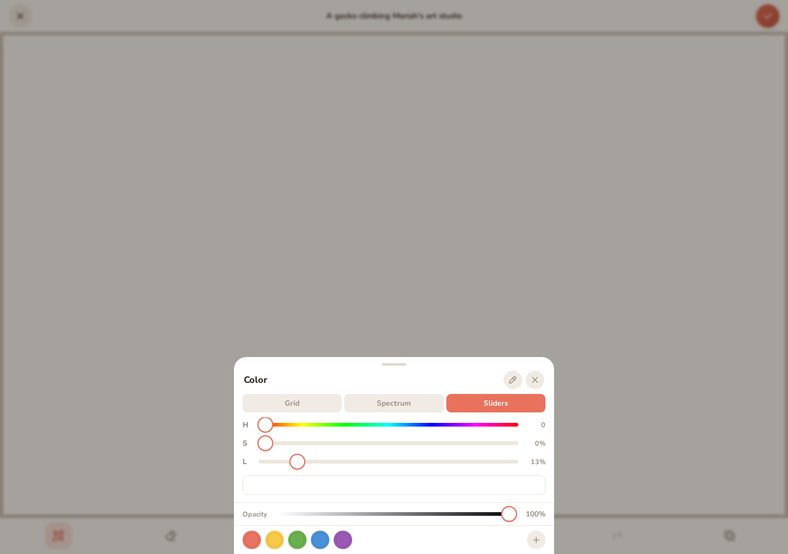

Fine-tune your colour with **Hue**, **Saturation**, and **Lightness** sliders. A preview swatch shows your colour as you adjust. Great when you know exactly what you want.

### Eyedropper

Tap the **eyedropper** button (pen icon, top-right of the colour panel) to pick a colour from anywhere on your canvas. A magnifying loupe appears showing the pixels under your cursor with the hex colour code. Click to grab that colour!

The eyedropper also works on selected objects — pick a new colour and it updates the selected stroke, text, or shape.

<br clear="both"/>

---

## Text

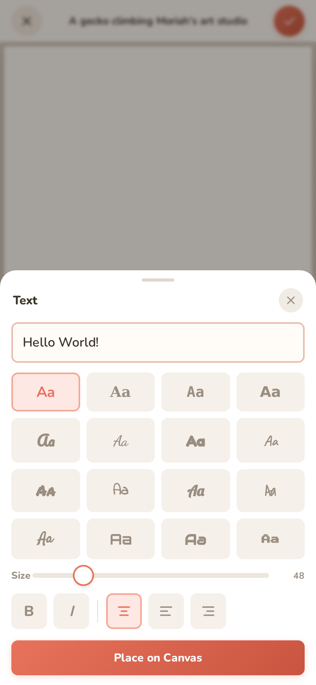

Tap **Text** in the submenu to add text to your artwork.

### Options
- **Text Input** — Type whatever you like (multi-line supported!)
- **Font** — Choose from **16 fonts** including:
  - Clean & simple: Nunito, Serif, Monospace
  - Fancy & handwritten: Pacifico, Dancing Script, Caveat, Satisfy, Shadows Into Light, Indie Flower
  - Bold & fun: Fredoka One, Lobster, Permanent Marker
  - Techy & retro: Orbitron, Audiowide, Press Start 2P
  - Classic: Cursive
- **Size** (12–200px)
- **Bold** and **Italic** toggles
- **Alignment** — Left, Centre, or Right

### Placing Text
1. Type your text and pick your style
2. Tap **Place Text**
3. Move your cursor/finger to position it — you'll see a preview with a dashed outline
4. Scroll to resize while placing (desktop)
5. Click/tap to stamp it down!

Press **Escape** to cancel placement.

<br clear="both"/>

---

## Stickers

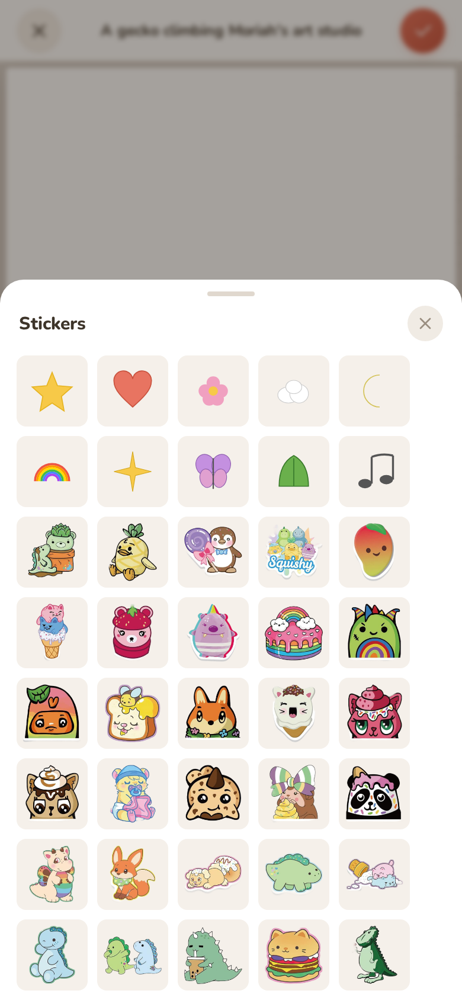

Tap **Stickers** in the submenu to open the sticker library. Elsie's Spark comes with **10 built-in SVG stickers** (star, heart, flower, cloud, moon, rainbow, sparkle, butterfly, leaf, music) plus loads of fun PNG stickers!

### Placing Stickers
1. Tap a sticker to select it
2. Move your cursor — a semi-transparent preview follows with a dashed circle
3. **Resize**: Scroll wheel (desktop) or pinch (touch)
4. **Rotate**: Shift + Scroll (desktop) or pinch-twist (touch)
5. Click/tap to place it!

**Touch controls**: On touch devices, extra buttons appear — **Shrink**, **Grow**, **Rotate Left**, **Rotate Right**, and **Cancel**.

<br clear="both"/>

---

## Shapes

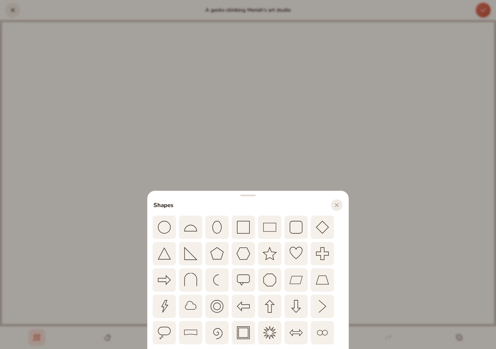

Tap **Shapes** in the submenu to access **27+ vector shapes** drawn in your current colour:

Circle, Semicircle, Oval, Square, Rectangle, Rounded Rectangle, Diamond, Triangle, Right Triangle, Pentagon, Hexagon, Star, Heart, Cross, Arrows (all directions), Arch, Crescent, Speech Bubble, Octagon, Parallelogram, Trapezoid, Lightning, Cloud, Ring, Chevron, Thought Bubble, Banner, Spiral, Frame, Starburst, Double Arrow, Infinity

Shapes work just like stickers — tap to select, position, resize, rotate, and place.

The shape takes on whatever colour you currently have selected, so pick your colour first!

<br clear="both"/>

---

## Layers

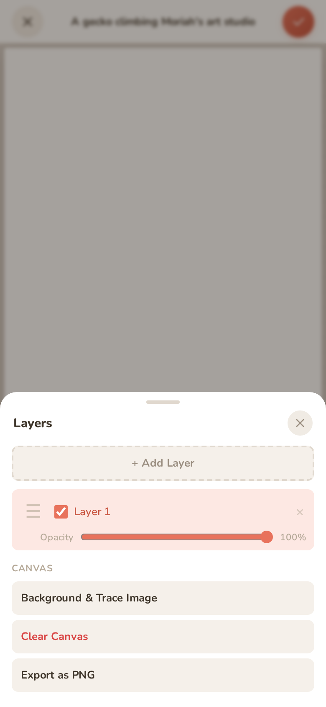

Layers let you stack parts of your drawing on top of each other — just like sheets of tracing paper. Tap the **Layers** button in the toolbar to manage them.

### What You Can Do
- **Add Layer** — Creates a new empty layer on top
- **Tap a layer name** — Makes that layer active (your new strokes go here)
- **Drag the handle** — Reorder layers by dragging them up or down
- **Visibility checkbox** — Show or hide a layer (hidden layers don't appear in exports either)
- **Opacity slider** — Make a whole layer semi-transparent (0–100%)
- **Delete** — Remove a layer (you always need at least one!)

### Tips
- Use separate layers for background elements, main drawing, and details — makes it easy to change things without messing up the rest
- Hide a layer temporarily to work on what's behind it
- Lower a layer's opacity for a subtle, watercolour-like effect

<br clear="both"/>

---

## Selecting & Moving Things

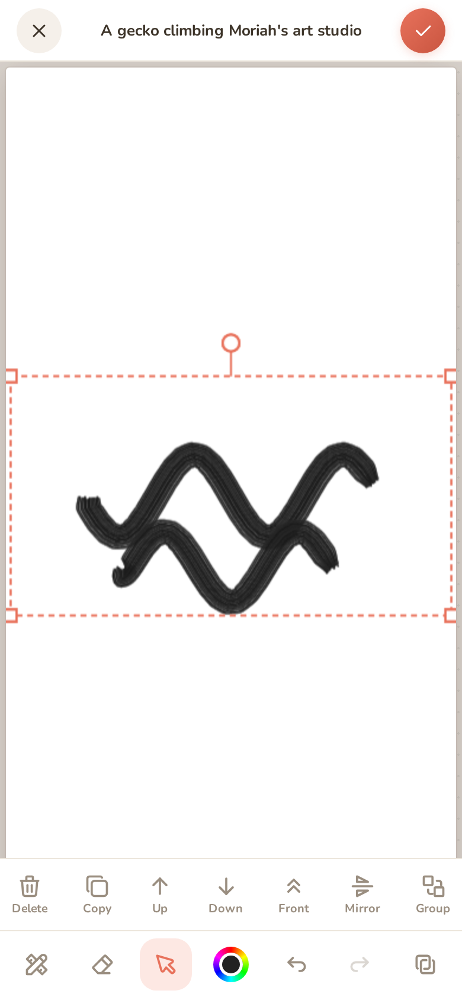

Tap the **Pointer** (arrow) tool in the toolbar to enter Select mode.

### Single Selection
- **Tap an object** (stroke, sticker, text, shape) to select it
- **Handles** appear around it — 8 squares for resizing and a rotation handle at the top

### What You Can Do With a Selection

| Button | Action |
|--------|--------|
| **Delete** | Remove the object |
| **Copy** | Duplicate it |
| **Up / Down** | Move it forward or backward in the stack |
| **Front / Back** | Jump to the very front or very back |
| **Mirror** | Flip it horizontally |
| **Group** | Combine multiple selected objects into one group |
| **Ungroup** | Break a group back into separate objects |

### Multi-Selection
- **Drag on empty canvas** to draw a selection box (marquee) around multiple objects
- All the same tools work on multiple objects at once — move, resize, rotate, delete, copy
- The **Group** button appears when you have 2+ objects selected

### Transforming Objects
- **Move**: Drag the selected object(s)
- **Resize**: Drag any corner or edge handle
- **Rotate**: Drag the rotation handle (the one sticking out from the top)

<br clear="both"/>

---

## Eraser

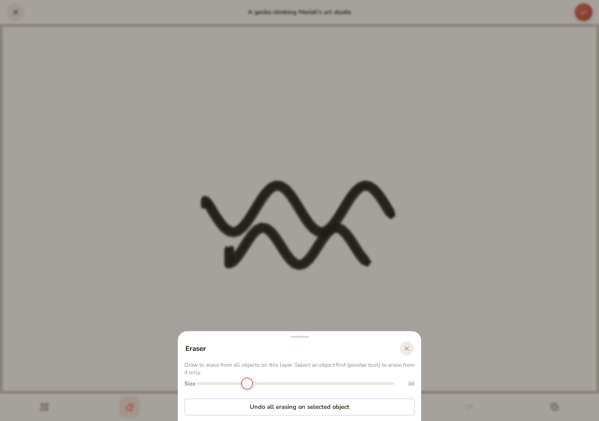

Tap the **Eraser** in the toolbar to rub things out.

- **Drag across the canvas** to erase parts of strokes
- **Size slider** — Adjust how big the eraser is (default 30px)
- **Target mode** — The eraser works on the object you have selected, or on all objects on the current layer
- **Clear Erases** button — Undo all erasing on the selected object (brings it back!)

The eraser doesn't delete whole objects — it carves into them. If you want to remove an entire object, select it with the Pointer tool and hit Delete instead.

<br clear="both"/>

---

## Backgrounds & Tracing

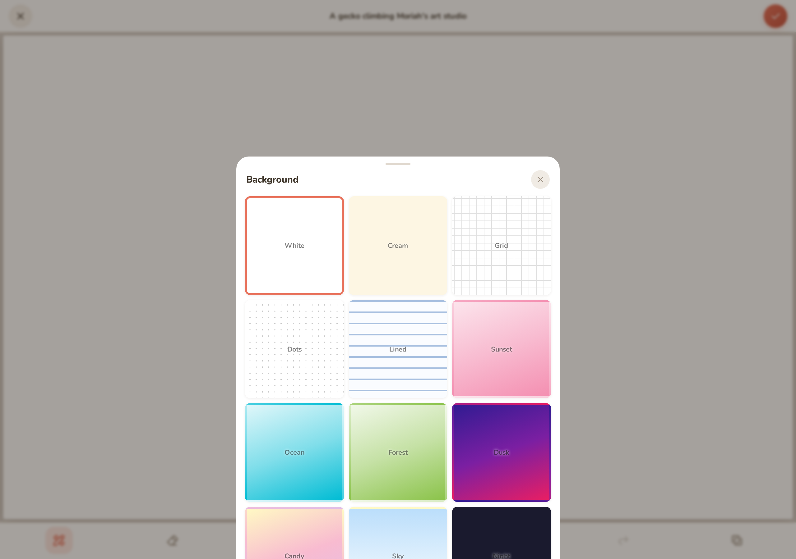

Tap **Backgrounds** in the submenu to customise what's behind your drawing.

### Backgrounds
Choose from predefined background colours and patterns. The background appears behind all your layers and is included when you export.

### Trace Image
Want to draw over a photo? Tap **Import** to load an image from your device. It appears as a faded reference behind your canvas — perfect for tracing!

Tap **Clear Trace** to remove the reference image when you're done.

### Export
The **Export** button lives here too — tap it to save your finished artwork as a **PNG image** with all visible layers and the background merged together.

<br clear="both"/>

---

## Undo & Redo

Made a mistake? No worries!

- **Undo** — Takes back your last action (up to 30 steps back!)
- **Redo** — Brings back what you just undid

The buttons grey out when there's nothing left to undo or redo.

Starting a new action after undoing will clear your redo history — so if you undo 5 steps and then draw something new, those 5 undone steps are gone for good.

---

## Zoom & Pan

### Desktop
- **Scroll wheel** — Zoom in and out (zooms towards your cursor)
- **Zoom reset button** — Appears when you're zoomed in; tap to fit the canvas back to your screen

### Touch
- **Pinch with two fingers** — Zoom in and out
- **Drag while pinching** — Pan around the canvas

Zoom range: **5% to 800%** — get right up close for pixel-perfect details or zoom way out to see the big picture.

**Keyboard**: Press **Ctrl+Shift+F** to fit the canvas to your screen.

---

## Gallery

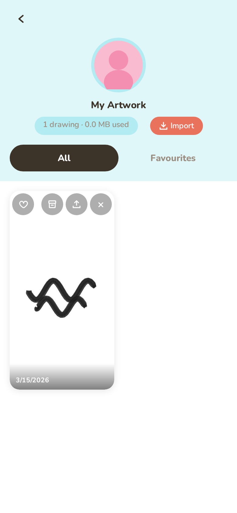

The Gallery shows all your saved projects as thumbnails. Tap any project to open it and keep working on it.

Projects save with a thumbnail preview so you can easily find what you're looking for.

<br clear="both"/>

---

## Daily Sparks (Inspiration)

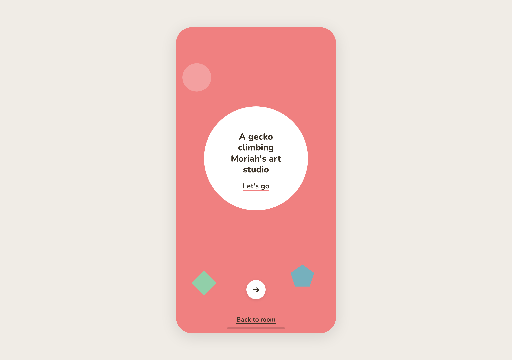

Stuck for ideas? Head to **Inspire** from the Room!

Every day you get a fresh drawing prompt from a collection of **100 creative prompts**. The prompt for each day is picked based on the date, so everyone using the app gets the same prompt on the same day.

1. Read your daily prompt
2. Tap **Let's go** to start creating
3. When you're happy, tap **Done** to save your work and advance to the next prompt

It's a lovely way to build a daily drawing habit!

<br clear="both"/>

---

## Saving & Exporting

### Auto-Save
Your work saves automatically every 2 seconds while you're drawing. It also saves when you switch tabs, close the browser, or navigate away. You'll never lose your work!

### Manual Save
Press **Ctrl+S** (or **Cmd+S** on Mac) any time to save immediately.

### Export as PNG
Open the **Backgrounds** panel and tap **Export** to download your artwork as a PNG image file. The export merges all visible layers with the background — hidden layers are excluded.

### Where Is My Data?
Everything is stored locally on your device using IndexedDB. Nothing is uploaded anywhere — your art stays yours!

---

## Keyboard Shortcuts

| Shortcut | Action |
|----------|--------|
| **Ctrl+Z** (Cmd+Z) | Undo |
| **Ctrl+Y** (Cmd+Y) | Redo |
| **Ctrl+S** (Cmd+S) | Save |
| **Ctrl+Shift+F** | Fit canvas to screen |
| **Delete** or **Backspace** | Delete selected object |
| **Escape** | Deselect / cancel placement / close panel |
| **Scroll wheel** | Zoom (or resize sticker/text during placement) |
| **Shift + Scroll** | Rotate sticker during placement |

---

## Touch & Tablet Tips

Elsie's Spark is designed to work beautifully on touch screens:

- **Draw with your finger or stylus** — full pressure-free drawing on any touch device
- **Pinch to zoom** — Two fingers to zoom and pan around the canvas
- **Pinch stickers** — While placing a sticker, pinch to resize and twist to rotate
- **Swipe panels down** — Drag any settings panel downward to close it
- **Touch buttons** — When placing stickers, extra buttons appear for Shrink, Grow, Rotate Left, and Rotate Right — no scroll wheel needed!

---

## Works Offline!

Elsie's Spark is a **Progressive Web App (PWA)**. After your first visit, everything is cached locally and the app works completely offline — on a plane, in a car, wherever inspiration strikes.

All your artwork is stored on your device, so it's always there when you come back.

---

## Have Fun!

That's everything! Elsie's Spark is all about creativity, play, and making art that makes you smile. There are no rules — mix brushes, pile on stickers, layer up colours, and make something uniquely yours.

Happy drawing! 🎨
